<div align="center">



</div>

<br>

## ⚙️  Current Status

```yaml
direction:     still_exploring   # exploring AI/ML + DevOps, full-stack on the side
motivation:    "solve a real problem with tech, not just ship a demo"
learning_now:  [ JavaScript beyond basics, DSA fundamentals, whatever breaks next ]
mode:          build → break → understand → rebuild
```

<br>

## 🎛️  What I'm Optimizing For

| chasing                      | not chasing                 |
| ---------------------------- | --------------------------- |
| understanding *why* it works | memorizing *that* it works  |
| shipping something small     | planning something huge     |
| a real, annoying problem     | a flashy but pointless demo |

<br>

## 🧬  Stack

<div align="center">


<br><br>

| 🟢 Comfortable | 🟡 Getting there | 🔵 Just started |
| :------------: | :--------------: | :-------------: |
|       C++      |    JavaScript    |      Python     |
|   HTML / CSS   | DSA fundamentals |        —        |
|      Java      |         —        |        —        |

</div>

<br>

## 🔴  Live Build

<table>
<tr>
<td width="65%" valign="top">

### Expense Tracker

*built solo · deployed · still iterating*

Tracks expenses, savings, and account balance for a person **or** a business — with name-based search across both expenses and savings, so nothing gets lost in a list.

The real win wasn't the CRUD logic. It was learning what *"live"* actually means — pushing something that has to keep working after you close the laptop.

</td>
<td width="35%" valign="top" align="center">

<br>

[](https://sem-2-project-expense-tracker.vercel.app/)

<br>

`stack: HTML · CSS · JavaScript`
`status: deployed ✅`

</td>
</tr>
</table>

<br>

## 📓  Field Notes

```
> don't wait for the "right" idea before starting — start, then find out.
> real problem > cool tech. keep checking which one you're actually chasing.
> if it's not deployed, it doesn't count as done yet.
```

<br>

## 🟢  Terminal Log

```bash
$ hackerrank --lang=C --handle=sanskritikrana
> practicing C — the language that started it all
> building fundamentals one problem at a time
✔ still going
```

<br>

## 🧠  How I Build

Creative, experimental, a little restless. I'd rather prototype an idea badly today than plan it perfectly and never start. Most of what pulls me in isn't "cool tech" for its own sake, it's a real, annoying, everyday problem that tech happens to be good at fixing.

Not much to point to as a finished trophy case yet, that part's still being built, on purpose, in public.

<br>

## 📡  Live Build Signal

<div align="center">


<br><br>

<table>
<tr>
<td align="center">

**CURRENT STATE**

<br>

`BUILDING`

</td>

<td align="center">

**DIRECTION**

<br>

`EXPLORING`

</td>

<td align="center">

**NEXT TARGET**

<br>

`REAL PROBLEM`

</td>
</tr>
</table>

<br>

```text
contributions → experiments → projects → better problems
```

</div>

<br>

<div align="center">

## 📡  Connect

[](https://www.linkedin.com/in/sanskriti-rana/)
[](mailto:sanskritikrana@gmail.com)

<br>

```
$ echo "still compiling..."
```

</div>

<!-- if you're reading the raw markdown instead of the rendered page, we'd probably get along -->
